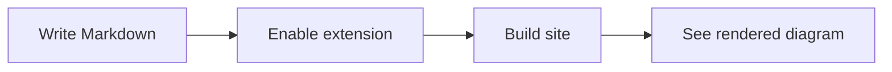

This post is a dedicated demo for the optional Markdown-related extensions in `pocket-hugo-theme`.

To see every block below rendered as intended, enable the related switches in `hugo.toml`:

```toml
[params.extensions]
  mermaid = true
  katex = true
```

Syntax highlighting is included by default. For Mermaid and KaTeX, add a page-level list in the front matter of the article that actually needs them:

```yaml
extensions:
  - mermaid
  - katex
```

## Syntax Highlighting

Pocket Hugo includes a small syntax color layer by default, so normal highlighted code blocks do not need any extra page-level switch.

```go
package main

import "fmt"

func main() {
    theme := "pocket-hugo-theme"
    enabled := []string{"syntax", "mermaid", "katex"}
    fmt.Println(theme, enabled)
}
```

```css
.article-content pre {
  border-radius: 18px;
  overflow-x: auto;
}
```

## Mermaid

When the `mermaid` extension is enabled, fenced code blocks with the `mermaid` language are converted into diagrams on the page.



## KaTeX

When the `katex` extension is enabled, inline and block math can render directly inside the article.

Inline math: $E = mc^2$

Block math:

$$
\int_{0}^{1} x^2 \, dx = \frac{1}{3}
$$

$$
f(x) = \frac{1}{\sqrt{2\pi\sigma^2}}
\exp\left(-\frac{(x-\mu)^2}{2\sigma^2}\right)
$$

## Mixed Content

The main goal of this post is to show that code, diagrams, and formulas can live together in one normal article layout without breaking the theme rhythm.

1. Syntax highlighting improves token contrast.
2. Mermaid turns fenced blocks into SVG diagrams.
3. KaTeX renders math without changing your writing flow too much.
