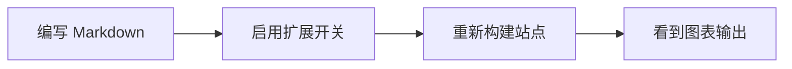

这篇文章专门用来演示 `pocket-hugo-theme` 里几个可选的 Markdown 外挂能力。

如果想看到下面所有内容都按预期渲染，请先在 `hugo.toml` 里打开对应开关：

```toml
[params.extensions]
  mermaid = true
  katex = true
```

代码高亮这层小样式默认就会带上。对于 Mermaid 和 KaTeX，再在真正需要这些能力的文章 front matter 里加上页面级列表：

```yaml
extensions:
  - mermaid
  - katex
```

## Syntax 代码高亮

主题默认就会给 Hugo 自带的 Chroma 类名补上一层轻量的代码 token 配色，所以普通代码块不需要额外声明页面级开关。

```go
package main

import "fmt"

func main() {
    theme := "pocket-hugo-theme"
    enabled := []string{"syntax", "mermaid", "katex"}
    fmt.Println(theme, enabled)
}
```

```css
.article-content pre {
  border-radius: 18px;
  overflow-x: auto;
}
```

## Mermaid 流程图

开启 `mermaid` 后，语言标记为 `mermaid` 的代码块会自动在页面里渲染成图表。



## KaTeX 数学公式

开启 `katex` 后，文章里可以直接书写行内公式和块级公式。

行内公式：$E = mc^2$

块级公式：

$$
\int_{0}^{1} x^2 \, dx = \frac{1}{3}
$$

$$
f(x) = \frac{1}{\sqrt{2\pi\sigma^2}}
\exp\left(-\frac{(x-\mu)^2}{2\sigma^2}\right)
$$

## 混合排版效果

这篇文章的重点，是展示代码块、流程图和数学公式可以一起出现在同一篇普通文章里，同时仍然保持这个主题原本的阅读节奏。

1. Syntax 负责增强代码 token 的层次。
2. Mermaid 会把代码块转成 SVG 图表。
3. KaTeX 负责把数学公式渲染成更适合阅读的形式。
