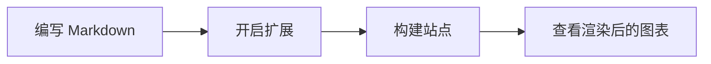

这篇文章专门用于演示 `pocket-hugo-theme` 中与 Markdown 相关的可选扩展能力。

如果你希望下面所有区块都按预期渲染，请先在 `hugo.toml` 中打开对应开关：

```toml
[params.extensions]
  mermaid = true
  katex = true
```

代码高亮样式默认已经内置。对于 Mermaid 和 KaTeX，还需要在真正使用它们的文章 front matter 中声明页面级列表：

```yaml
extensions:
  - mermaid
  - katex
```

## Syntax Highlighting

Pocket Hugo 默认附带了一层轻量的代码高亮配色，所以普通的高亮代码块不需要额外开启页面级开关。

```go
package main

import "fmt"

func main() {
    theme := "pocket-hugo-theme"
    enabled := []string{"syntax", "mermaid", "katex"}
    fmt.Println(theme, enabled)
}
```

```css
.article-content pre {
  border-radius: 18px;
  overflow-x: auto;
}
```

## Mermaid

开启 `mermaid` 扩展后，语言标记为 `mermaid` 的代码块会在页面中被转换成图表。



## KaTeX

开启 `katex` 扩展后，文章中的行内公式和块级公式都可以直接渲染。

行内公式：$E = mc^2$

块级公式：

$$
\int_{0}^{1} x^2 \, dx = \frac{1}{3}
$$

$$
f(x) = \frac{1}{\sqrt{2\pi\sigma^2}}
\exp\left(-\frac{(x-\mu)^2}{2\sigma^2}\right)
$$

## Mixed Content

这篇文章的重点，是展示代码、图表和数学公式可以同时出现在一篇普通文章里，而且不会破坏主题原有的阅读节奏。

1. Syntax highlighting 用来增强代码 token 的对比度。
2. Mermaid 会把围栏代码块转换成 SVG 图表。
3. KaTeX 负责渲染数学公式，同时不打断写作流程。
