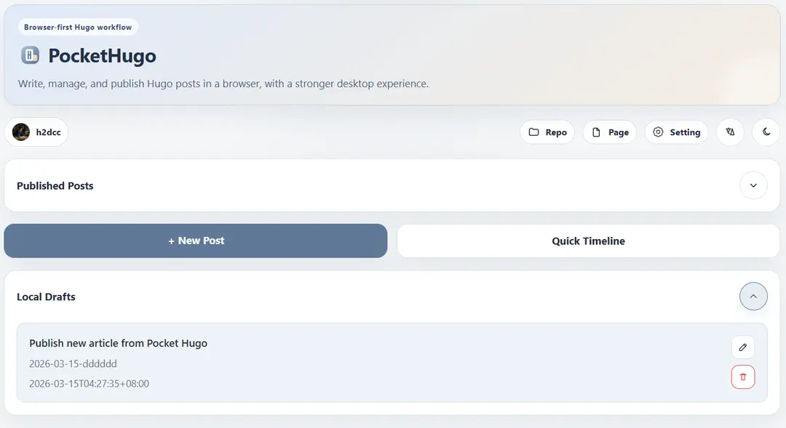
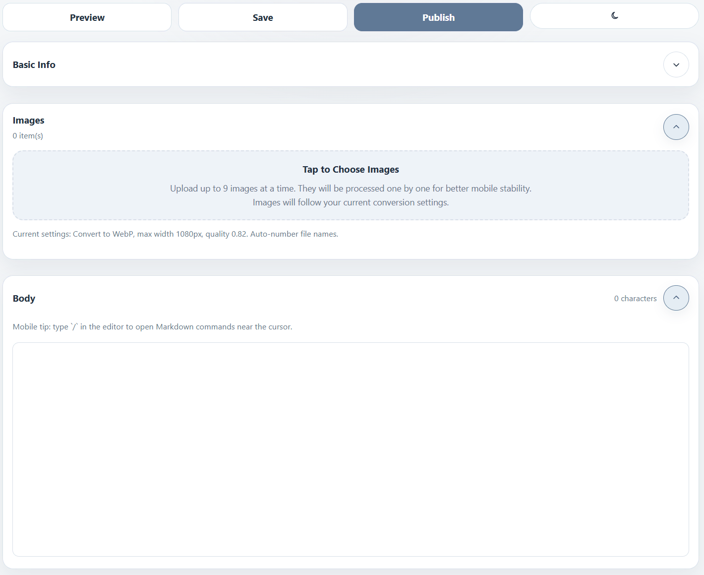
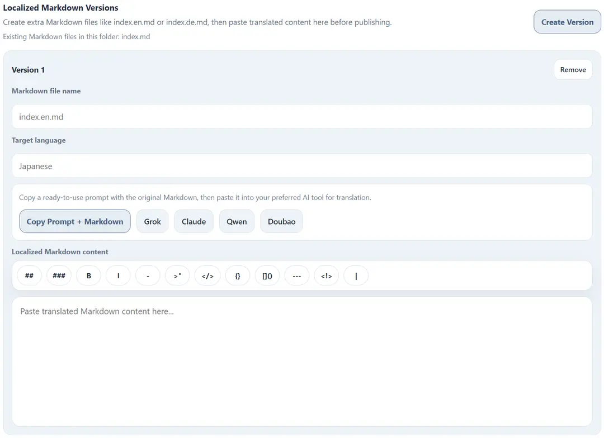
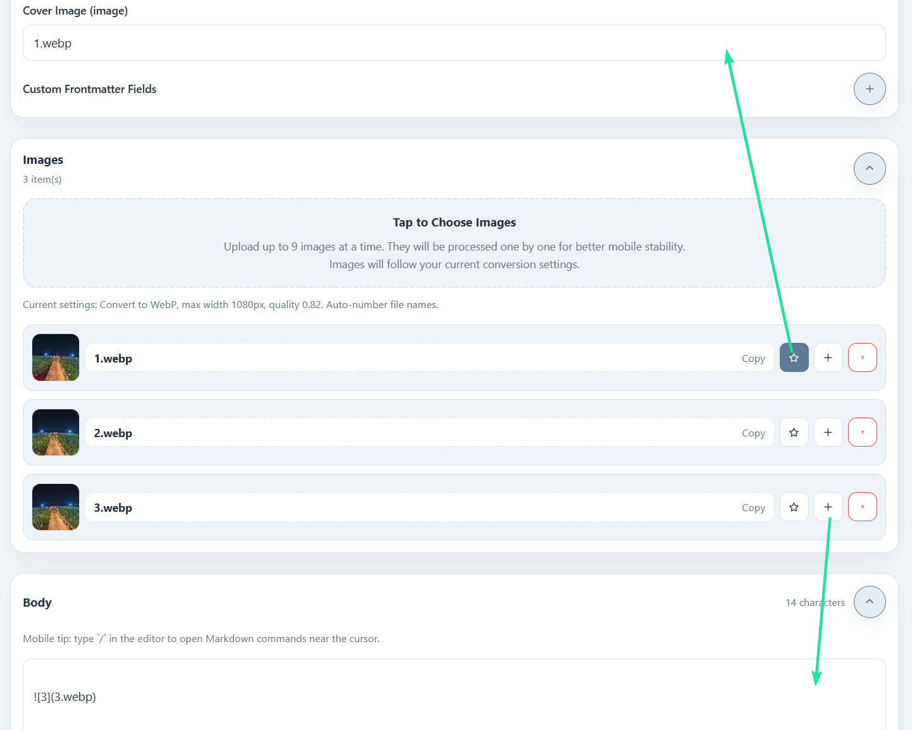
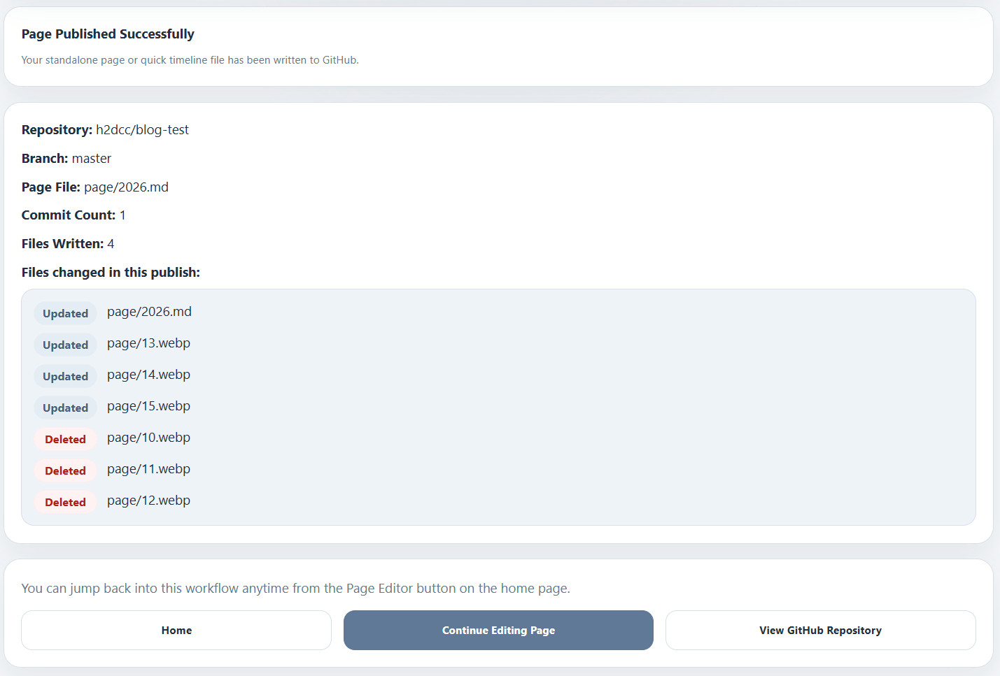

+++
title = "Pocket Hugo: Browser-First Publishing for Hugo"
date = 2026-03-23T15:30:00+08:00
slug = "pocket-hugo-project"
description = "Pocket Hugo is a browser-first publishing tool for Hugo, built for writing, image handling, and GitHub-based Markdown workflows across desktop, tablet, and phone."
summary = "A closer look at Pocket Hugo as a browser-first Hugo workflow, including publishing, images, multilingual bundles, and why it pairs naturally with pocket-hugo-theme."
categories = ["writing"]
tags = ["pocket-hugo", "workflow", "multilingual", "mobile"]
comments = false
covercard = "D"
+++

Pocket Hugo is a browser-first publishing tool for Hugo across desktop, tablet, and phone. It is designed for people who keep their content in GitHub repositories and want to write, manage, and publish Markdown in the browser without being tied to one main computer.

What makes it interesting is not just that it runs in the browser. Its homepage describes it more directly: Pocket Hugo combines GitHub publishing, local drafts, higher-efficiency WebP image handling, and page editing into one browser workflow while staying close to real Hugo content structures. That makes it a natural sister project to `pocket-hugo-theme`.

- GitHub repo: https://github.com/h2dcc/pocket-hugo
- Production landing: https://leftn.com
- Production app entry: https://leftn.com/app

## Why it exists

Many Hugo workflows still assume that writing happens on one main computer, with image handling, front matter editing, and publishing all done in separate steps. Pocket Hugo tries to reduce that friction.

It is especially useful when:

- you want to continue drafting on a phone or tablet
- you publish directly from GitHub-hosted content
- you want image handling to stay close to the post itself
- you use multilingual bundles and need to create translated versions quickly

## What it brings together

Pocket Hugo is best understood as a publishing workflow rather than a generic Markdown editor. It brings several useful pieces into one place:

- GitHub sign-in and direct publishing
- support for three Hugo-friendly content structures
- image compression, conversion, and auto naming during upload
- local draft recovery in the browser
- loading published posts back from GitHub for another round of editing
- standalone page editing and Quick Timeline updates

That is also why the homepage feels more like a product landing page than a developer tool page. It is selling a smoother Hugo workflow, not just a text box.

## Writing around Hugo structures

Pocket Hugo currently works best with three content layouts:

1. Flat Markdown files for simple, text-first notes.
2. Single-language bundles for richer posts with local assets.
3. Multilingual bundles for translated articles that share the same folder and assets.

That structure awareness is important. It affects how new posts are created, how existing posts are loaded, and how content is pushed back to GitHub.

## Post editor and publishing flow

The editor is divided into a few practical sections: basic info, body content, images, and front matter. In bundle-based modes, image upload and asset management are available directly in the writing flow.

That makes the tool feel closer to a focused publishing interface than a generic Markdown editor. You are not just writing text. You are preparing a Hugo post in the shape the site actually expects, then sending it back into a Git-based workflow.

## Multilingual workflow

One of the more distinctive parts of Pocket Hugo is its multilingual bundle support. The preview area can expose the current Markdown, help you copy it into another translation workflow, then bring the translated content back into a new file such as `index.zh-cn.md`, `index.de.md`, or another language variant.

This is particularly useful for writers who publish in more than one language but do not want to maintain a heavy CMS.

## Image handling

Pocket Hugo also pays special attention to the image workflow. It supports upload, preview, conversion, cover selection, file insertion, and lighter-weight compression. The current pipeline is especially aimed at reducing oversized images from phones and tablets before they are published into the repository.

That focus on bundled content is one reason the theme and the editor fit together so well. The theme assumes cover-driven posts and bundle-friendly content. Pocket Hugo helps produce exactly that kind of material.

## Publishing back to GitHub

When a post is ready, Pocket Hugo commits the Markdown file and related assets back to the configured repository. The result view makes the output more transparent by showing the repository, branch, path, and changed files.

That makes it easier to trust the publishing step, especially when writing away from your normal development environment.

## Why it fits this theme

`pocket-hugo-theme` is designed for long-term personal writing with strong cover presentation, calm reading rhythm, and multilingual support. Pocket Hugo complements that by making the authoring side simpler.

Together they are a good match for people who want:

- a light browser-based writing workflow
- Hugo-native content structures
- multilingual publishing without a large CMS
- article cards and covers that still read well on mobile

Pocket Hugo is not trying to replace every possible static-site workflow. It is most useful when your content already lives in a Hugo-shaped repository and you want the writing experience to be faster, lighter, and more mobile-friendly.

The positioning on the homepage also says it well: it is built for Hugo first, but still compatible with adjacent Markdown workflows such as Astro or Hexo when the repository follows similar content patterns.
