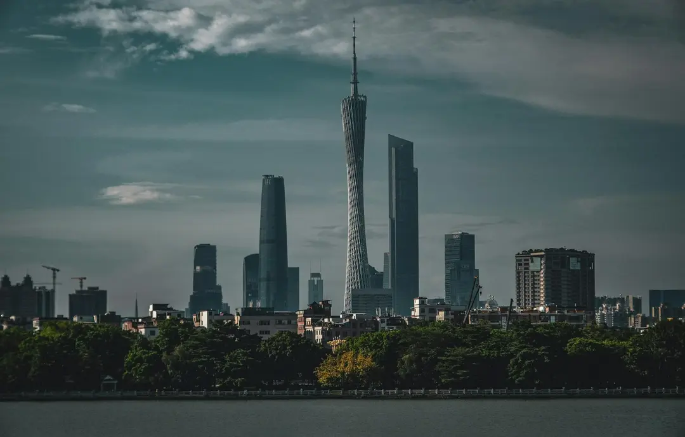

+++
image = "cover.webp"
title = "Responsive Image Pipeline Demo"
date = 2026-03-21T09:00:00+08:00
draft = false
description = "A sample post for checking derived image sizes, inline rendering, and the built-in lightbox."
slug = "responsive-image-pipeline"
tags = ["images", "pipeline", "lightbox"]
categories = ["Images"]
comments = false
+++

This article demonstrates the theme's **responsive image pipeline** for inline Markdown images. The same source file is rendered inside the article, constrained by layout rules, and still available in a larger lightbox view.

<!--more-->

## Inline image test





This represents the default display behavior for images on the webpage. If you wish to adjust the image display height, you can configure this in `hugo.toml`. If you do not require this feature, you can disable it directly by setting: `limitHeight = false`.

```toml
  [params.images.content]
    mobileMaxHeight = "160px"
    tabletMaxHeight = "250px"
    desktopMaxHeight = "350px"
```


This page complements the [Image Configuration Reference](/article/image-config-reference/), which focuses on article headers and card covers instead.

